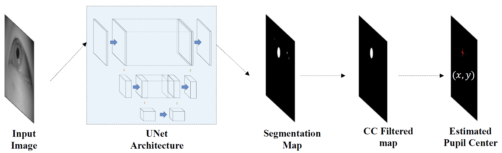
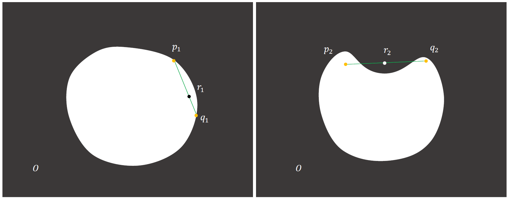
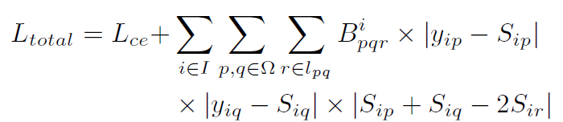
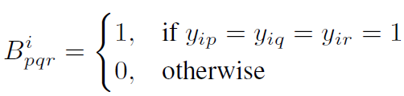
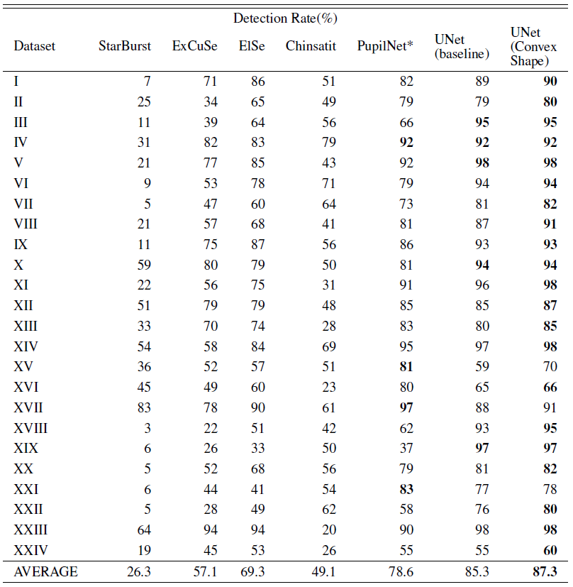
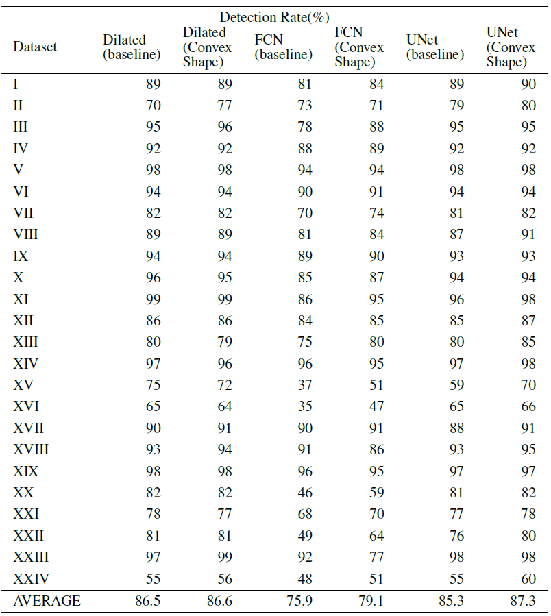
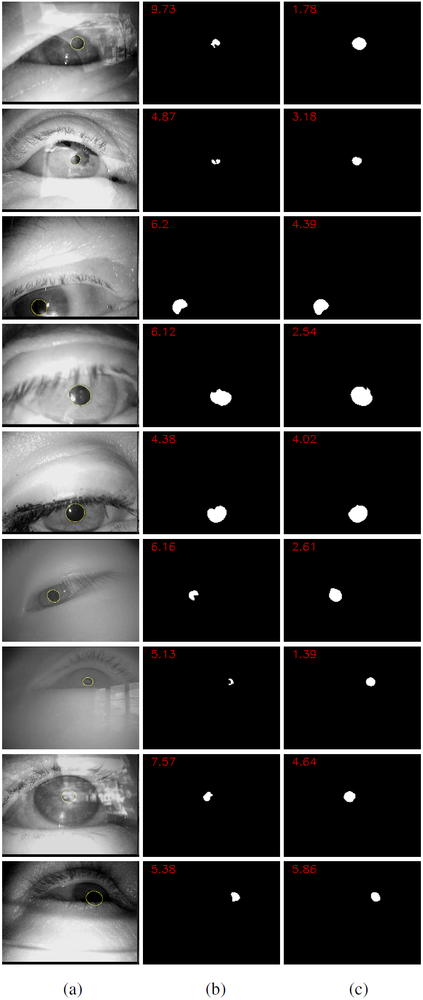

# Noise-Robust Pupil Center Detection through CNN-Based Segmentation with Shape-Prior Loss

Sang Yoon Han, Hyuk Jin Kwon, Yoonsik Kim, and Nam Ik cho

[[Paper]](https://~)

## Environments
- Ubuntu 18.04
- [Tensorflow 1.13](http://www.tensorflow.org/)
- [Pytorch 1.1](https://pytorch.org/)
- CUDA 9.0.176 & cuDNN 7.3.1
- Python 3.6.8

## Abstract

Detecting the pupil center plays a key role in human-computer interaction, especially for gaze tracking. The conventional deep learning-based method for this problem is to train a convolutional neural network (CNN), which takes the eye image as the input and gives the pupil center as a regression result. In this paper, we propose an indirect use of the CNN for the task, which first segments the pupil region by a CNN as a classification problem, and then finds the center of the segmented region. This is based on the observation that CNN works more robustly for the pupil segmentation than for the pupil center-point regression when the inputs are noisy IR images. Specifically, we use the UNet model for the segmentation of pupil regions in IR images and then find the pupil center as the center of mass of the segment. In designing the loss function for the segmentation, we propose a new loss term that encodes the convex shape-prior for enhancing the robustness to noise. Precisely, we penalize not only the deviation of each predicted pixel from the ground truth label but also the non-convex shape of pupils caused by the noise and reflection. For the training, we make a new dataset of 111,581 images with hand-labeled pupil regions from 29 IR eye video sequences. We also label commonly used datasets (ExCuSe and ElSe dataset) that are considered real-world noisy ones to validate our method. Experiments show that the proposed method performs better than the conventional methods that directly find the pupil center as a regression result.
<br><br>

## Brief Description of Our Proposed Method

### <u>Overall Workflow of The Proposed Method</u>

<p align="center"></p>

### <u>Example object O that satisfies convex shape condition and does not satisfy convex shape condition.</u>

<p align="center"></p>

Example object O that satisfies convex shape condition and does not satisfy convex shape condition.

We add a convex-shape regularization term that any line connecting two arbitrary points of the segmentation region is inside the region. The entire loss term incorporating the convex shape prior is

<p align="center"></p>

where

<p align="center"></p>

## Experimental Results

**Performance comparison on each data sequence from ExCuSe \& ElSe, in terms of Detection rate ($\%$) allowing 5-pixel error tolerance. In the case of PupilNet*, we report the performance shown in the original publication.**

<p align="center"></p>
<p align="center"></p>

## Visualized Results

<p align="center"></p>

Qualitative comparison of segmentation results with/without regularization term: (a) input image with ground truth (b) result with only unary term (c) result with additional regularization term that encodes the convex shape prior. Numbers on (b),(c) represent error of estimated pupil center position.
<br><br>

## Guidelines for Codes

**Requisites should be installed beforehand.**

Clone this repo.

```
git clone http://github.com/jaegal88/pupil-shape-prior.git
cd ShapePrior/
```

### Test

## Dataset

[**Pupil Binary Label Dataset**](https://drive.google.com/file/d/1TfCDiw7mRAbf2JA6tng7y3WC3PLF7pXv/view?usp=sharing)


## Citation
When you use data or codes in this site,
please cite the following paper:

```
@article{han2020gaze,
  title={Noise-Robust Pupil Center Detection through CNN-Based Segmentation with Shape-Prior Loss},
  author={Han, Sang Yoon and Kwon, Hyuk Jin and Kim, Yoonsik and Cho, Nam Ik},
  journal={IEEE Access},
  volume={8},
  pages={177427--177437},
  year={2020},
  publisher={IEEE}
}
```
